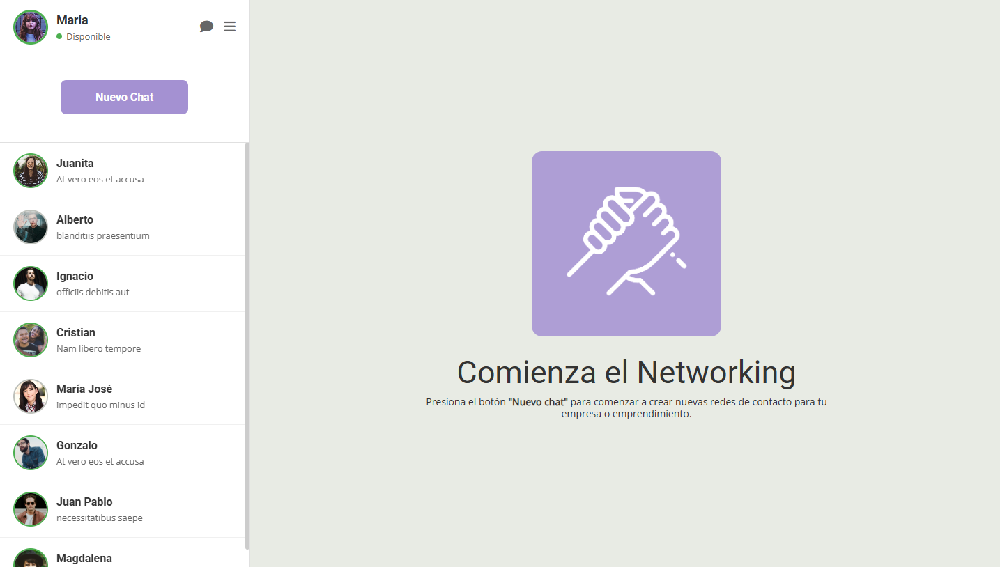
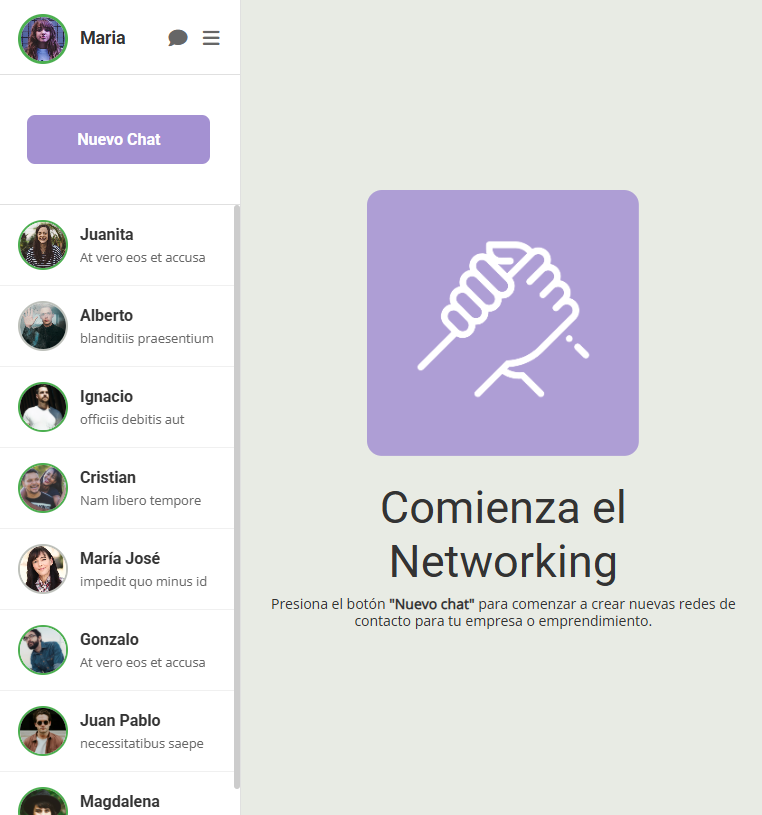
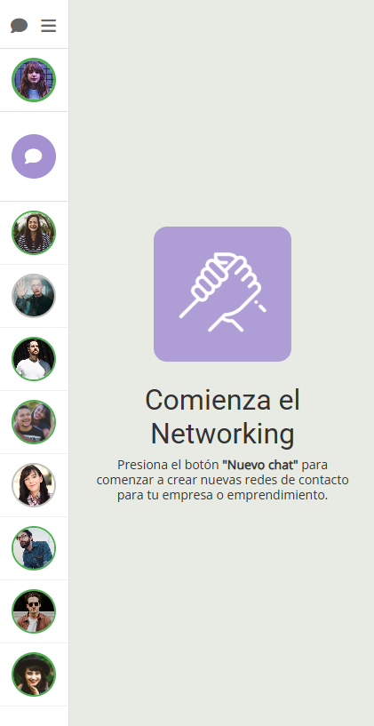
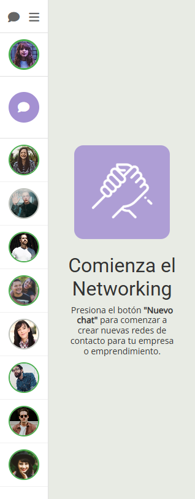

# Chat App | Contact Me SPA

Una aplicación de chat responsive construida únicamente con **Flexbox** y **HTML5 semántico**, sin uso de Bootstrap.

## 🌐 Demo en Vivo

**[Ver Demo](https://edolivares.github.io/desafio_latam_G103_CSS_desafio_01/)**

## 📱 Vistas Responsive

### Desktop (≥769px)



**Base**: Mockup original entregado por Desafío Latam

### Tablet (≤768px)



**Modificaciones propias**:

- Ocultado el texto "Disponible" en el header para evitar elementos muy justos
- Mantenido el punto verde de estado

### Mobile (≤576px)



**Modificaciones propias**:

- Sidebar colapsado a 80px de ancho por temas de espacio
- Separación de la imagen de perfil de los íconos en el header
- Información de usuario y chats oculta
- Botón "Nuevo Chat" convertido a ícono circular

### Mobile Small (≤320px)



**Optimizaciones adicionales** para pantallas muy pequeñas.

## 🎨 Características Implementadas

### Estados de Usuario

- **Activo**: Borde verde `#4caf50` (por defecto)
- **Inactivo**: Borde gris `#F7BFB6`
- **Notificaciones**: Badge rojo "+1" en avatares con mensajes nuevos

### Diseño Responsive

- **Flexbox puro** para layouts
- **HTML5 semántico** (`<aside>`, `<main>`, `<header>`, `<section>`)
- **Media queries** para breakpoints específicos
- **Tipografía**: Google Fonts (Roboto, Open Sans)

### Funcionalidades

- **Scroll personalizado** en lista de chats
- **Hover effects** en elementos interactivos
- **Transiciones suaves** en botones e íconos
- **Bordes de estado** en todas las pantallas

## 🛠️ Tecnologías Utilizadas

- **HTML5** (Semántico)
- **CSS3** (Flexbox, Media Queries)
- **Google Fonts** (Roboto, Open Sans)
- **Font Awesome** (Íconos)

## 📁 Estructura del Proyecto

```
├── assets/
│   ├── css/
│   │   └── style.css
│   ├── images/
│   │   ├── users/          # Avatares de usuarios
│   │   └── hand.png        # Ícono principal
│   └── readme/             # Imágenes del README
├── index.html
└── README.md
```

## 📱 Breakpoints

- **Desktop**: ≥769px
- **Tablet**: ≤768px
- **Mobile**: ≤576px
- **Mobile Small**: ≤320px

---

**Desarrollado para Desafío Latam - Módulo CSS Avanzado**
